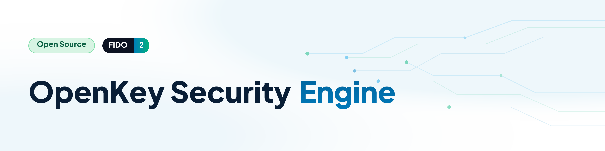

# OpenKey - FIDO2 / WebAuthn Hardware Security Key


Open-source FIDO2 / WebAuthn hardware authenticator and companion application. It delivers enterprise-grade passwordless authentication, hardware-enforced encryption, anti-tracking pseudonymity, and cryptographic duress countermeasures.

Present version supports the **ESP32-S3** platform, more to be added soon..


---

## Architecture Overview

### 1. Hardware Security Engine (`firmware/`)
- **Micro-controller**: Espressif ESP32-S3 (Xtensa Dual-Core LX7 @ 240MHz).
- **Cryptographic Protocols**: FIDO2 (CTAP 2.0 / 2.1), U2F (CTAP 1), WebAuthn Level 3.
- **Algorithms**: ES256 (ECDSA P-256 with SHA-256), Ed25519 (COSE -8), RS256.
- **Hardware Security Enforcements**:
  - `eFuse`-enforced AES-256-XTS flash encryption.
  - Die True Random Number Generator (TRNG - NIST SP 800-90B compliant).
  - Capacitive Touch User Presence (`UP`) verification on GPIO 1.
  - Hardware NeoPixel status & identification signaling on GPIO 21.
  - **Resident Passkey Capacity**: 1,000 discoverable credentials stored in wear-leveled flash (1.875 MB allocated).
  - **Anti-Coercion Duress PIN**: Instant hardware zeroization (~15 ms) upon coercion emergency.
  - **Stealth / FIDO MDS Attestation Profiles**: Dynamic AAGUID profile switching.

### 2. Desktop Companion App (`desktop_manager/`)


- **Framework**: Tauri v1.5 + Rust backend.
- **Cross-Platform**: Native standalone binaries for **Windows** (`.exe`, `.msi`), **macOS** (`.dmg`, `.app`), and **Linux** (`.AppImage`, `.deb`).
- **Features**:
  - Real-time hardware telemetry and resident key inventory gauge.
  - Device identification toggle (WS2812B).
  - Device PIN and Duress PIN management.
  - BIP-39 deterministic seed backup & restore.
  - FIDO MDS (Metadata Service) attestation and specification inspection.

---

## Multi-OS Builds & Releases

The project includes an automated GitHub Actions CI/CD matrix ([`.github/workflows/release-companion.yml`](.github/workflows/release-companion.yml)) that compiles native binaries for Windows, macOS, and Linux upon pushing a version tag:

```bash
git tag v1.0.0
git push origin v1.0.0
```

### Local Compilation (Windows)
Run the turnkey script:
```cmd
desktop_manager\build_release_windows.bat
```

For macOS and Linux instructions, see [PACKAGING_GUIDE.md](desktop_manager/PACKAGING_GUIDE.md).

---

## License

Open source under the Apache License 2.0.
